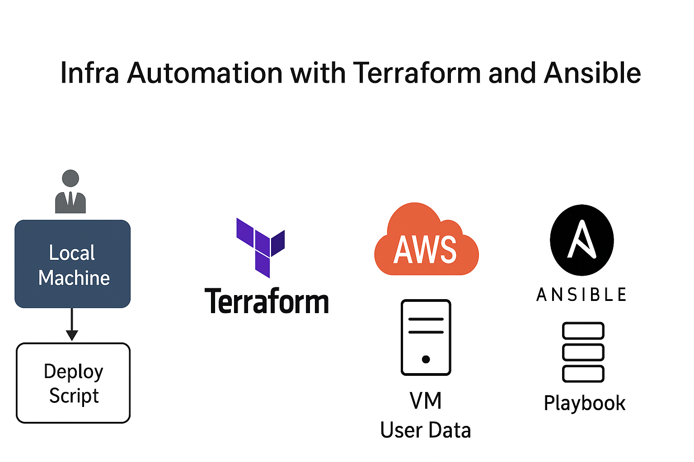

# 🚀 IaC Automation — Automatisation complète d’une infrastructure AWS avec Terraform, Ansible & GitHub Actions

## 🎯 Objectif

Ce projet met en œuvre une chaîne CI/CD Infrastructure-as-Code (IaC) permettant de :
- Créer automatiquement une infrastructure AWS avec Terraform.
- Exécuter un playbook Ansible pour configurer la VM (installation d'Apache et déploiement d'une page de test).
- Orchestrer le tout avec GitHub Actions, sans aucune intervention manuelle.

## 🧩 Architecture

  

## 🧰 Stack technique
- **Terraform** : provisionne l’infrastructure AWS (EC2, clés SSH, etc.)
- **Ansible** : configure la VM (packages, services, etc.)
- **GitHub Actions** : orchestration complète CI/CD
- **AWS S3** : Backend distant pour Terraform
- **Amazon EC2** : Hébergement du serveur web
- **Apache** : Serveur HTTP déployé automatiquement

## 🛠 Prérequis

1. Un compte AWS avec des permissions suffisantes.
2. Une paire de clés SSH accessible localement (privée & publique).
3. Avant d’exécuter les workflows, vous devez configurer les secrets GitHub suivants :
- `AWS_ACCESS_KEY_ID` : ID de l’utilisateur IAM disposant des droits sur S3, EC2
- `AWS_SECRET_ACCESS_KEY` : Clé secrète associée
- `AWS_DEFAULT_REGION` : Région AWS (ex: `us-west-1`)
- `SSH_PUBLIC_KEY` : Clé publique utilisée pour la KeyPair Terraform
- `SSH_PRIVATE_KEY` : Clé privée correspondante (pour Ansible)

## 💡 Fonctionnement global

1. **Terraform** : crée une instance EC2 sur AWS et injecte la clé publique SSH.
2. **Ansible** : utilise la clé privée pour se connecter à la VM et installer Apache.
3. **Apache** : sert une page HTML simple pour valider que le déploiement fonctionne.
4. **GitHub Actions** : automatise tout (Terraform + Ansible).

## 🧱 Les 4 Workflows
1️⃣ **bootstrap.yml**  
Crée automatiquement le bucket S3 utilisé comme backend Terraform et enregistre son nom dans un fichier `backend-info.json` sur S3.  
🔹 Étapes :
- Configure les credentials AWS
- Génère un bucket unique (`terraform-backend-xxxxxx`)
- Stocke le nom du bucket pour les workflows suivants  

2️⃣ **deploy.yml**  
Déploie l’infrastructure complète et configure le serveur Apache.  
🔹 Étapes :
- Télécharge le nom du bucket S3 créé par `bootstrap`
- Initialise Terraform avec ce backend
- Crée l’instance EC2, la KeyPair, le Security Group, etc.
- Configure le serveur web Apache via Ansible  

3️⃣ **destroy.yml**  
Détruit proprement toutes les ressources Terraform (VM, SG, KeyPair, etc.).  
🔹 Étapes :
- Récupère le backend
- Exécute `terraform destroy -auto-approve`
- Supprime les ressources sans laisser de trace  

4️⃣ **clean.yml**  
Supprime le backend S3 et les artefacts restants.  
🔹 Étapes :
- Télécharge le fichier `backend-info.json`
- Vide le contenu du bucket S3
- Supprime le bucket et le JSON

## 📦 Structure
```
├── ansible
│   ├── ansible.cfg
│   ├── collections
│   │   └── requirements.yml
│   ├── inventory
│   │   └── aws_ec2.yaml            # Inventaire dynamique AWS
│   ├── playbook.yml                # Playbook principal
│   └── roles
│       └── apache
│           ├── handlers
│           │   └── main.yml
│           ├── tasks
│           │   └── main.yml        # Installation et configuration Apache
│           ├── templates
│           │   └── index.html.j2
│           └── vars
│               └── main.yml
├── docs
│   ├── architecture.md
│   └── architecture.png
├── README.md
├── terraform
│   ├── bootstrap
│   │   └── main.tf                 # Création du backend S3
│   └── main
│       ├── backend.tf
│       ├── main.tf                 # Infrastructure principale (EC2, SG, etc.)
│       ├── outputs.tf
│       ├── provider.tf
│       └── variables.tf
└── .github/workflows/
    ├── bootstrap.yml               # Crée le bucket S3 backend
    ├── deploy.yml                  # Déploie l’infra + configuration Ansible
    ├── destroy.yml                 # Supprime l’infrastructure
    └── clean.yml                   # Supprime le backend S3
```

## 🧪 Déploiement & Tests

1. **Clonez ce dépôt**  
   ```bash
   git clone https://github.com/Hrubech/iac-automation-project.git
   cd iac-automation-project
   ```

2. **Déployer l’infrastructure**     
Depuis votre dépôt GitHub :  
- Allez dans **Actions** → **Bootstrap Backend** → **Run workflow**  
  ➜ Cela crée automatiquement le bucket S3 utilisé comme backend Terraform.
- Puis lancez **Deploy Infrastructure with Terraform & Ansible** (`deploy.yml`)  
  ➜ Terraform crée l’infrastructure, Ansible configure Apache.

🧠 Une fois terminé, vous verrez l’adresse IP publique de la VM dans les logs Terraform :  
    ```bash
    Outputs:  
    web_public_ip = "13.56.xxx.xxx"
    ```

3. **Vérifier le déploiement**
- Ouvrez votre navigateur et accédez à :  
```bash
    http://<web_public_ip>
```
💡 Si tout s’est bien passé, vous verrez :  
| 🟢 “Déploiement réussi – IaC Automation”  

4. **Détruire l’infrastructure** 
- Lancez le workflow **Destroy Infrastructure** (`destroy.yml`)  
  ➜ Supprime l’instance EC2, le security group et la keypair.

5. **Nettoyer le backend**
- Enfin, exécutez **Clean Backend** (`clean.yml`)  
  ➜ Cela vide et supprime le bucket S3, ainsi que le fichier `backend-info.json`.

## 🔐 Sécurité

- Ne jamais committer votre clé privée.
- Le fichier .gitignore inclut les entrées nécessaires pour les exclure.
- Utiliser IAM et rôles minimaux dans AWS.
- Utilisez des variables d'environnement pour les informations sensibles si besoin.

## 📖 Points clés du projet

✅ 100 % automatisé (création → déploiement → suppression)  
✅ Infrastructure reproductible et versionnée  
✅ Aucune manipulation manuelle requise  
✅ Compatible AWS, extensible à d’autres providers  
✅ Workflow modulaire (bootstrap / deploy / destroy / clean)

## 💡 Extensions possibles

- Ajout d’options : load balancer, base de données, monitoring
- Gestion de versions Ansible/Terraform via tfenv, ansible-core, etc.

## 🧑‍💻 À propos de l’auteur

Hrubech HOMBESSA — Ingénieur DevOps – Cloud, Automatisation & CI/CD.  
[Suivez moi sur LinkedIn](https://www.linkedin.com/in/hrubech-hombessa/).